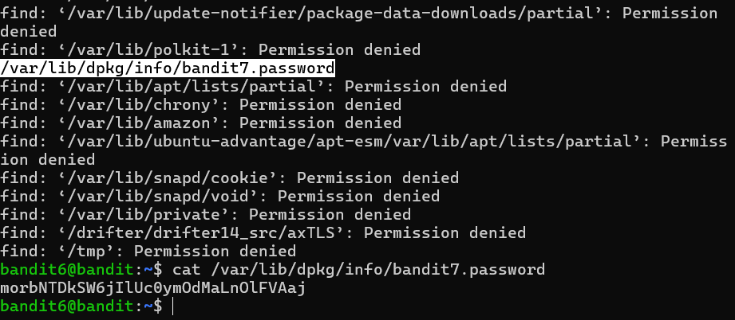
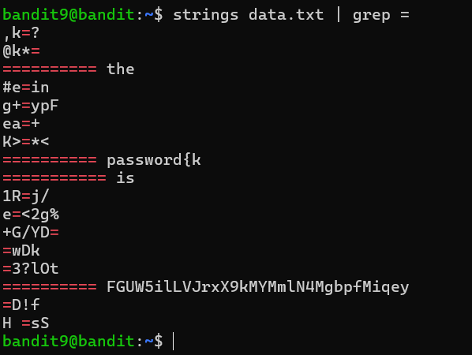
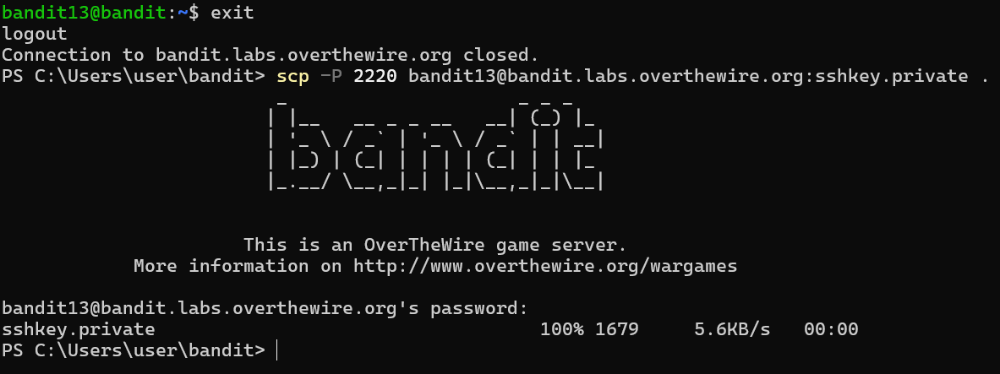
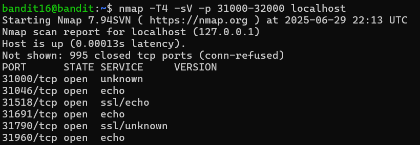
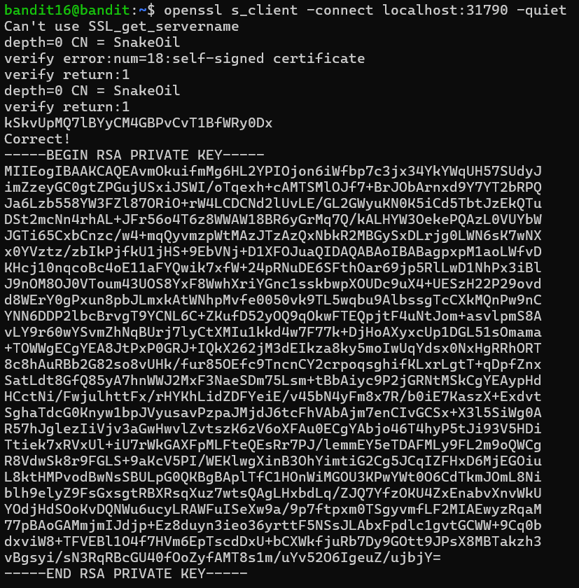
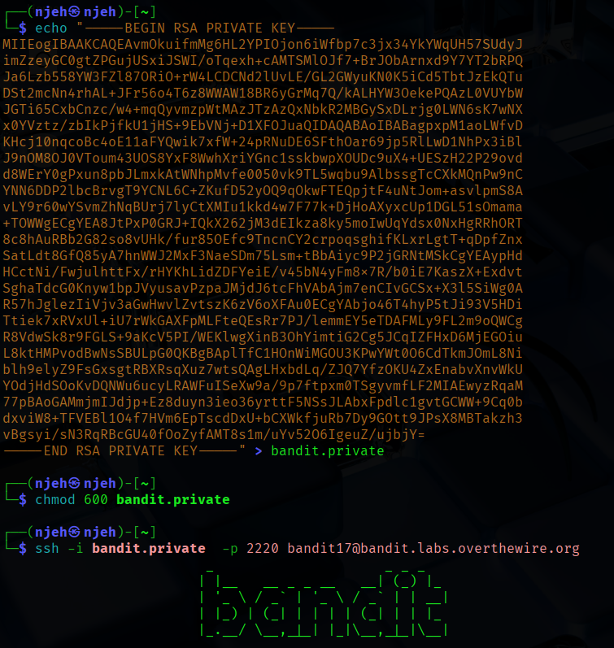
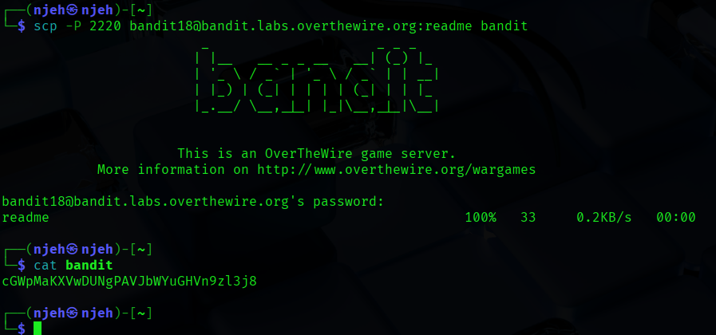
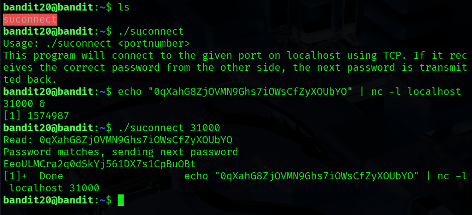

# Level 0

Using **ssh** command to connect to the server with the user **bandit0** over **port 2220**.

```console
$ ssh -p 2220 bandit0@bandit.labs.overthewire.org
```

The password is **bandit0**.

# Level 1

The command

```console
$ ls
```

gives us the files in the current directory. It prints out that there is a file named **readme**. Using

```console
$ cat readme
```

command, we get what that file holds inside.


The password is **ZjLjTmM6FvvyRnrb2rfNWOZOTa6ip5If**

# Level 2

We have a file named ' - ' . If we do

```console
$ cat -
```

it won't work because it's expecting standard input as the dashes are reserved for the parameters. What we can do is

```console
$ cat ./-
```

The ' . ' means current directory. Doing so, we are providing the path for the file we want to cat.


The password is **263JGJPfgU6LtdEvgfWU1XP5yac29mFx**

# Level 3

Spaces are special characters that can be used for other things not like the standard alphanumerical characters. To make the machine understand that our intention with spaces is the actual visible space, we write before them a backslash ' \\ ' .

```console
$ cat spaces\ in\ this\ filename
```


The password is **MNk8KNH3Usiio41PRUEoDFPqfxLPlSmx**

# Level 4

We have a folder called **inhere** that contains the password file. So we need to change our directory to it with the following command

```console
$ cd inheare/
```

The hint says that the file is hidden. Hidden files are the ones that their names start with " . " and to see them we use the command

```console
$ ls -al
```

The parametre **-a** is enough to do the job but I like to list my files each on its own line so I add the parameter **-l**.


The password is **2WmrDFRmJIq3IPxneAaMGhap0pFhF3NJ**

# Level 5

The hint says that the targeted file is the only human-readable file in **inheare/** folder that means that when we proceed **file** command on it, we get **ASCII text**.
So the trick is to run that command recursivly on all the files and grab the one that outputs **ASCII text**.

```console
$ cd inheare/
$ find -type f -exec file {} \; | grep text
$ cat ./-file07
```

Okay let's break that command down:

- " **find -type f -exec file {} \\;** " is responsible of listing the type of each file :
  - **find** is the command to find files or directories based on filters.
  - **-type** parameter filter the type. Since we're looking for files we put **f**.
  - **-exec** execute a seperate command on each found file.
    - **file** is the command.
    - **{}** is the argument placeholder : for each file treated, **{}** gets replaced with the file name.
    - " **\\;** " marks the end of the command. We wrote **\\** because -like we stated earlier- " **;** " is a special character and shell would recognize it as a sperator and reads the rest of the line as another command.
- " **| grep text** " filter the results to output only the ASCII file :
  - " **|** " pipes the output of the left part to the input of the right path. So basically we get the results of the previous job and set it as the input of the **grep** command.
  - **grep** shows specific parts of a text based on patterns and filterings we provide to it.
  - **text** is the filtering we are doing since we're only looking for files that output " **ASCII text** " as a result.


The password is **4oQYVPkxZOOEOO5pTW81FB8j8lxXGUQw**

# Level 6

It is a file so **-type f**, has a size of 1033 byte so **-size 1033c** (**c** stands for byte), **not** executable so **! -executbale**.

```console
$ cd inheare/
$ find -type f -size 1033c ! -executable
$ cat ./maybehere07/.file2
```


The password is **HWasnPhtq9AVKe0dmk45nxy20cvUa6EG**

# Level 7

The hints says that the file is somewhere in the server so we search in " **/** " directory which represents the very root of the server. We filter the **-user bandit7**, the **-group bandit6** and the **-size 33c**.

```console
$ find / -user bandit7 -group bandit6 -size 33c -type f
```



As we can see, the file is located in **/var/lib/dpkg/info/** under the name **bandit7.password**.

The password is **morbNTDkSW6jIlUc0ymOdMaLnOlFVAaj**

# Level 8

We simply cat the content and grep the keyword **millionth**.

```console
$ cat data.txt | grep millionth
```


The password is **dfwvzFQi4mU0wfNbFOe9RoWskMLg7eEc**

# Level 9

When we talk about occurence, what comes to mind is **sorting**, **minimizing** then **filtering**.

```console
$ sort data.txt | uniq -c | grep "1 "
```

- **sort** sorts the lines in the file alphabetically.
- **uniq** minimize adjacent identical lines and replace them with one instance. We add **-c** parameter to prefix each line the count of its original occurence.
- **grep "1 "** greps the line that starts with "**1**" which means with one occurence. Don't forget the space in the string after **1** otherwise it will outputs the lines with 10-19 occurence.


The password is **4CKMh1JI91bUIZZPXDqGanal4xvAg0JM**

# Level 10

Since it's looking for readable line, the command **strings** is super handy here since it only output the human-readable characters of a file. We follow it with **grep =** to look for strings that comes after few "**=**" as mentioned in the hint.

```console
$ strings data.txt | grep =
```



The password is **FGUW5ilLVJrxX9kMYMmlN4MgbpfMiqey**

# Level 11

The content of the file is coded in base64. so we decode it with **base64** command.

```console
$ cat data.txt | base64 -d
```


The password is **dtR173fZKb0RRsDFSGsg2RWnpNVj3qRr**

# Level 12

The content of the file is ciphered in ROT13 or known as Ceasar Cipher which is based on replacing each letter with with the one that follow it by 13 index.

```console
$ cat data.txt
```

We can decrypt it with **tr** command but it would be eaiser and practical to use **cyberchef.org** for this job.


The password is **7x16WNeHIi5YkIhWsfFIqoognUTyj9Q4**

# Level 13

First, we need to create a temporary directory so it we can do our work in it and can be deleted after we end the session.

```console
$ mkdir /tmp/njeh
$ cp data.txt /tmp/njeh/
$ cd /tmp/njeh/
```

The file is a hexdump. So we use **xxd** command with the parameter **-r** to reverse the process and get the original file and output the result with the name **flag**.

```console
$ xxd -r data.txt flag
```

From now on, the files we get are compressed files with various extensions. Each extension will have its own command and process. We get the extension of the compressed file with **file** command and we start our work :

- for **gzip** files, we rename the file to add **.gz** extension and decompress it with **gunzip** command.

```console
$ mv flag flag.gz
$ gunzip flag.gz
```

- for **bzip2** files, we rename the file to add **.bz2** extension and decompress it with **bunzip2** command.

```console
$ mv flag flag.bz2
$ bunzip2 flag.bz2
```

- for **tar** files, we decompress them with **tar -xf** command

```console
$ tar -xf flag
```


The password is **FO5dwFsc0cbaIiH0h8J2eUks2vdTDwAn**

# Level 14

We have an SSH private key file that will get us to connect to **level 14** machine.


We need to **exit** to our machine and copy that file with **scp** command to our local directory which is " . ".

```console
$ scp -P 2220 bandit13@bandit.labs.overthewire.org:sshkey.private .
```



Then we connect as user **bandit14** using the private key.

```console
$  ssh -i sshkey.private -p 2220 bandit14@bandit.labs.overthewire.org
```


And finally we get the password from the path provided by the hint.

```console
$ cat /etc/bandit_pass/bandit14
```


The password is **MU4VWeTyJk8ROof1qqmcBPaLh7lDCPvS**

# Level 15

A simple netcat connection to our localhost will do the job.

```console
$ nc localhost 30000
```


After typing the previous password and getting the new password, we can disconnect and get back to our shell with **Ctrl + C** on **Windows** or **Cmd + C** on **MacOS**

The password is **8xCjnmgoKbGLhHFAZlGE5Tmu4M2tKJQo**

# Level 16

Since it requires SSL/TLS encryption, we can connect using **openssl s_client** command

```console
$ openssl s_client -connect localhost:30001
```


After typing the previous password and getting the new password, we can disconnect and get back to our shell with **Ctrl + C** on **Windows** or **Cmd + C** on **MacOS**

The password is **kSkvUpMQ7lBYyCM4GBPvCvT1BfWRy0Dx**

# Level 17

We use **nmap** command to scan the ports and find our target.

```console
$ nmap -T4 -sV -p 31000-32000 localhost
```

- **-T4** sets the speed fo scanning to level 4. **-T0** for super stealthy and thus super slow and **-T5** for insanely fast. In real-world case, it's recommanded to go stealthy otherwise we will be detected and get our IP address banned but since we are pentesting a machine designed for pentesting, we can save some time and go crazy. We didn't set it to **-T5** bacause it can miss some open ports.
- **-sV** print out the service version of each scanned port based on nmap's data base. This way, we can know which port works with **ssl**.
- **-p** specifies the ports to be scanned. We set the interval **31000-32000**

As we can see, we have 6 open ports among them 2 run **ssl** service which are 31518 and 31790. If we look carefully, port 31518 runs **echo** service which prints out whatever we tell it and that's exactly what's stated in the hint. So let's proceed with port 31790.



As we did earlier, we use **openssl c_client** command. This time, we add **-quiet** parameter because the password we will type starts with the letter "**k**" which will trigger **KEYUPDATE**.

```console
$ openssl s_client -connect localhost:31790 -quiet
```



It printed out an **RSA PRIVATE KEY**. Obviously, we're gonna use it to access it to **level 17** as we did previously on **level 14**. So let's copy this on a file locally and get the job done.

```console
$ echo " put the RSA key here " > bandit.private
$ chmod 600 bandit.private
$ ssh -i bandit.private  -p 2220 bandit17@bandit.labs.overthewire.org
```



- **echo "something" > FileName** writes the "something" in the file. If the file doesn't exits, it gets created. If it does, it deletes its content and write the "something". If you want to append the content, use **>>** instead of ">".
- **chmod 600** changes the permission of tthe file so that only its owner can read it and write on it. **SHH** requires strict permission configurations so it can work

**Side Note** : You may notice that screenshots changed a bit. That's because I switch to **Linux**. Using **Windows**' **PowerShell**, I faced issues changing the file's permission configurations because it requires other commands that I'm not familiar with. After googling them, I felt sick and went stright back to my comfort place. Thank god for Linux !

```console
$ cat /etc/bandit_pass/bandit17
```


The password is **EReVavePLFHtFlFsjn3hyzMlvSuSAcRD**

# Level 18

The password is the difference between two files. Naturally, we use the command **diff**

```console
$ diff passwords.new passwords.old
```


"**<**" represents the first typed file and "**>**" represents the second.

The password is **x2gLTTjFwMOhQ8oWNbMN362QKxfRqGlO**

# Level 19

We can't log into this level because, as the hint stated, the file **.bashrc** has been altered so that we log out the second we log in. What we can do is copying the file that holds the password, which is named **readme**, into our machine and read it with ease.

```console
$ scp -P 2220 bandit18@bandit.labs.overthewire.org:readme bandit
$ cat bandit
```



The password is **cGWpMaKXVwDUNgPAVJbWYuGHVn9zl3j8**

# Level 20

As expected, we don't have permission to read the file.

```console
$ cat /etc/bandit_pass/bandit20
```


Let's follow the hint and run the binary without arguments. To run a binary, we write **./** before it.
The description says it runs commands as another user. From the name of the binary, we can guess the user it mentions is **bandit20**. From the example th description gave, we put command to run as an argument to the binary.

```console
$ ls
$ ./bandit20-do
$ ./bandit20-do cat /etc/bandit_pass/bandit20
```


The password is **0qXahG8ZjOVMN9Ghs7iOWsCfZyXOUbYO**

# Level 21

Running the binary, it tells us that is connects to localhost via a port specified as argument. When it reads the current password from the connection, it will gives us the new password. So what we need to do is setting up an **nc** connection with an arbitrary port and echo the password in its input to be written after connecting

```console
$ echo "0qXahG8ZjOVMN9Ghs7iOWsCfZyXOUbYO" | nc -l localhost 31000 &
```



- "**-l**" tells it to listen for incmoing connections and not start one because the communication will be started by the binary
- "**&**" sends the communication to the background and gives us the shell back. Without it, the communication interface will persist and wait for our input.

The password is **EeoULMCra2q0dSkYj561DX7s1CpBuOBt**
