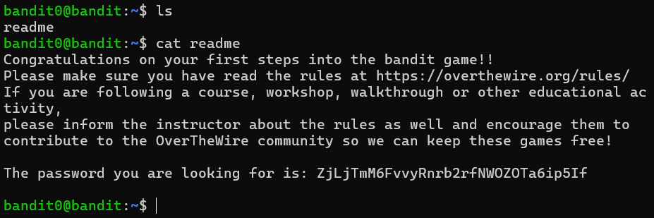

# Level 0

Using **ssh** command to connect to the server with the user **bandit0** over **port 2220**.

```console
$ ssh -p 2220 bandit0@bandit.labs.overthewire.org
```

The password is **bandit0**.

# Level 1

The command

```console
$ ls
```

gives us the files in the current directory. It prints out that there is a file named **readme**. Using

```console
$ cat readme
```

command, we get what that file holds inside.



The password is **ZjLjTmM6FvvyRnrb2rfNWOZOTa6ip5If**

# Level 2

We have a file named ' - ' . If we do

```console
$ cat -
```

it won't work because it's expecting standard input as the dashes are reserved for the parameters. What we can do is

```console
$ cat ./-
```

The ' . ' means current directory. Doing so, we are providing the path for the file we want to cat.


The password is **263JGJPfgU6LtdEvgfWU1XP5yac29mFx**

# Level 3

Spaces are special characters that can be used for other things not like the standard alphanumerical characters. To make the machine understand that our intention with spaces is the actual visible space, we write before them a backslash ' \\ ' .

```console
$ cat spaces\ in\ this\ filename
```


The password is **MNk8KNH3Usiio41PRUEoDFPqfxLPlSmx**
