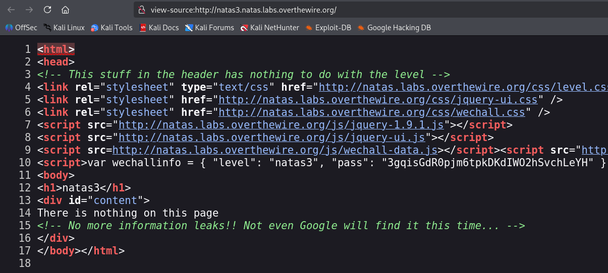
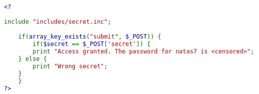

# Level 0

On the borwser, we type the URL **http://natas0.natas.labs.overthewire.org/** and provide the username **natas0** and password **natas0** as mentioned in the war game description.

# Level 1

To start with, we check the page source by right-clicking and choosing **view page source**.

The password is stated clearly as a comment on the line 16.

# Level 2

The problem with this level is that you can't right-click on it to go to the page source. But since I'm using **FireFox**, it allowed me to right-click it without any issue. But when I tried it with **Chrome** or **Edge**, it prompted me with an alert messag saying I can't use right-click. Anyway, the solution is to write right before the **URL** the key word **"view-source:"** .

The password is commented on line 17.

# Level 3

After checking the page source, we can see on line 15 that it is getting an image named **pixel.png** from a folder calld **files/**. Let's check that folder by typing it in the **URL**

We have infront of us two accessible files. One is that image and the other is a txt file.

After clicking on it, it revealed a list of users and their password. Among them, the user **natas3**.

# Level 4

After checking the page source, there is a comment that says Goofle will not find it. That's a hint !

Google uses cralwers to crawl over links and paths of the web. To prevent it from going certain paths, we write these paths on a file called **robots.txt**. So let's check it.

The disallowed path is **/s3cr3t/**.

Folloing it, we find the **users.txt** file like the previous level.

**users.txt** revealed the credentials for the user **natas4**.

# Level 5

We are not allowed to access the page and it tells that it is expecting access from another webpage. This brings us to the concept of **Referer** (yes, an R is missing) which tells from where we came. Let's assume we are on website A and there is a link to website B. When we click it it gets us to website B with the **Referer** holding the website A as we came from there.

To solve this, let's intercept the request right before clicking the **refresh** link and change our **Referer**.

As you can see, the **Referer** field is set to **"http://natas4.natas.labs.overthewire.org/"**. So let's change it to **"http://natas5.natas.labs.overthewire.org/"** and hit **Forward** button.

# Level 6

We are disallowed. Source page didn't reveal anything useful. So let's look around for anything suspecious.

Checking the **Cookies**, we can spot an interesting one named **loggedin** with a value of **0**.

In many programming languages, 0 reffers to False and any other number reffers to True. So let's try changing that cookie's value to 1 and then refreshing the page.

# Level 7

Here we need a secret phrase. Viewing the page source didn't give us anything useful but following the link provided gave as an extra part in the source code which is a php code. This code can be read only by the server that's why we couldn't see it when checking source page on our own.

That piece of code started with including a specific file from a specific folder. so let's follow it by typing it on the **URL** above.

It gave us a blank page. But viewing its source page gave us the secret phrase.

Typing that secret phrase in the input field will grant us access and reveal the next password.

# Level 8

The hint provided in source page is that the password is listed in **/etc/natas_webpass/natas8**. And when follow links for **Home** or **About**, we can clearly see in the url above that it ends with **index.php?page=** followd by our destination. So let's try to replace the destination by **/etc/natas_webpass/natas8**.

# Level 9

Following the same process in **level 7**. We find some php code. It gae us the secret in its encrypted form along with the function of the encyrption which is **bin2hex(strrev(base64_encode($secret)))**. So basically, it takes the secret as input and converts it to base64 then reverses the result and finally it converts the final result to hex.

To decrypt it, we can revert the process using **CyberChef** by converting from Hex then reversing and finally converting from Base64.

And voilà! We get the secret that will grant us access to the password.

# Level 10

Here, it takes our input and put it directly in a shell command without sanitization to search for it with **grep** command in a file called **directory.txt**.

We can exploit it by making our input a valid command and seperate it from the rest of the command that it is intented to be added to it with th use of semicolon **" ; "**. For exapmle, typing **" ; whoami ; "** will print us the current user.

So let's get the password by typing **" ; cat /etc/natas_webpass/natas10 ; "**.

